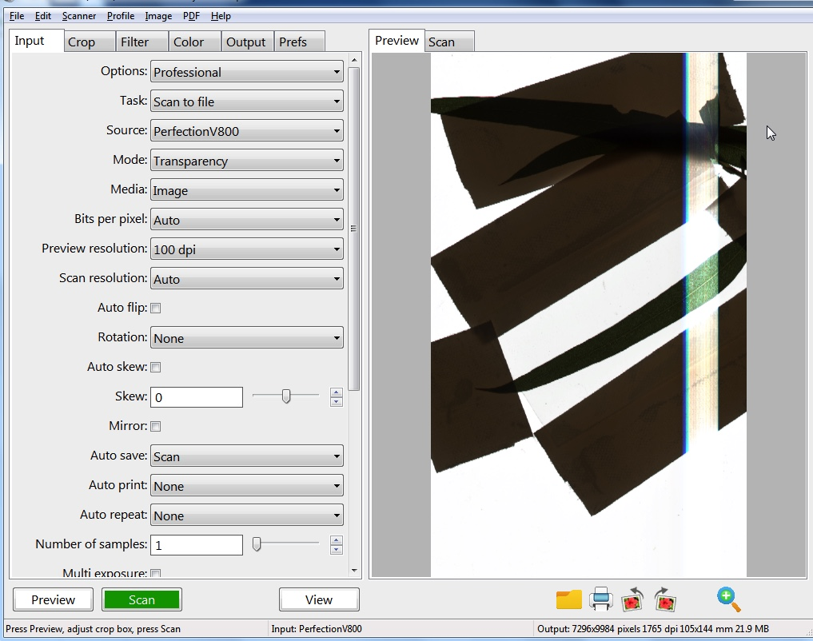

# Scanner Image Capture Instructions

## What you'll need

* Flatbed Scanner with an optical resolution of at least 2400 DPI and transmissive scanning ability - see [Transmissive Scanners](#transmissive-scanners) for more information. 
* OpenSourceOV caviscan scripts - download the latest version from  [https://github.com/OpenSourceOV/caviscan/archive/master.zip](https://github.com/OpenSourceOV/caviscan/archive/master.zip)
* AutoIT automation software (free) - download from [AutoIT](https://www.autoitscript.com/site/autoit-script-editor/downloads/)
* VueScan scanner software (Professional Edition, $90 USD) - download and purchase from [Hamrick Software](https://www.hamrick.com/)
* Windows-based computer. For running on mac see [Running on a mac](#running-on-a-mac).
* Scholander pressure chamber (pressure bomb) to measure sample water potential over time. A psychrometer can be used as an alternative e.g. the [ICT Stem Psychrometer](http://www.ictinternational.com/products/psy1/psy1-stem-psychrometer/) is excellent.


## Instructions

1. Start measuring water potential and continue to measure at regular intervals through the setup and image capture process.

2. Install AutoIT

3. Install VueScan and activate the professional edition using the purchased license key.

4. Connect the scanner to the computer and follow steps to install any required drivers.

5. Create a parent folder to contain all the scans and scripts

    ```
    c:\data
    ```

6. Create a directory for the scripts in the parent folder

    ```
    c:\data\scripts
    ```

7. Move/copy/download the two caviscan files (caviscan.au3 and include.au3) into the scripts folder

    

8. Create a copy of the caviscan.au3 file and give it name appropriate to the sample/session

    e.g.

    ```
    c:\data\scripts\obliqua-22012017.au3
    ```

    


9. Prepare the sample in the scanner. Follow the [Sample Preparation Guide](#sample-preparation-guide).

10. Open VueScan and restore settings. 
    
    **Important**: From the File menu select 'Default options' to restore VueScan to the default settings. This should be done before every configuration setup.

     

11. Select 'Professional' from the Options drodown. 

    

12. Select the scanner from the Source dropdown. 

    

13. Select the relevant mode from the Mode dropdown (Flatbed for reflective, Transparency for transmissive).

    

14. Press preview to test that the scanner and software are working.

    
    
    If you get any vertical banding like this:

    

    ...then the sample or tape is overlapping the edge of the glass and needs to be moved down:

    
    

    Fixed:

    


15. Right-click the caviscan file and select 'Edit script' and follow the [Configuration Guide](#configuration-guide) to configure.

    

16. Cover the scanner with light-blocking material (light blocking curtain material works well).

17. Maximise the VueScan window. 

    

18. Open the folder containing the caviscan script and right-click the script and select 'Run'. The script will initiate a VueScan setup as required or immediately begin the scanning procedure.

    

19. To stop the scanning procedure **before completion** (the script will stop automatically using the configured end date), find the AutoIT icon in the task tray (to the right of the task bar at the bottom of the screen), right-click and select 'Stop script'.

    


All the files will be saved in the OUTPUT_FOLDER using the following directory structure and file naming convention:

```
OUTPUT_FOLDER\sample_name\mode\resolution\YYYY-MM-DD-0001+.[jpg|tiff]

e.g.

C:\Data\Eucalyptus_2102107\Leaf_1\Trans\2400\2017-01-22-0001.tif
```

--------

## Sample Preparation Guide

### Getting the sample in focus

The optimimum focal point should be directly on the surface of the glass. However, an individual scanner may have a slightly different focal point as a result of irregularities in the manufacturing process. 

A good way to check the focal point is to stack four or five coins on the glass surface with each adjusted slightly so they can all be viewed from underneath. Perform a scan and you should be able to see which of the coins are in focus. This will tell you the [depth of field](https://en.wikipedia.org/wiki/Depth_of_field) and whether or not sample placed directly on the glass will be in focus or will need to be elevated. A section of clear glass under the sample can be used for elevation.

 
 

For this scanner we can see the depth of field extends from the face of the glass at least two coins up with coins 3 and 4 starting to get out of focus.

 

### Securing the sample in place

It is very important that the sample should be as immovable as possible to reduce the introduction of any non-embolism events e.g. leaf movement as the scanner is bumped. Gaffer tape or any other strong cloth-backed adhesive tape works best and can be used to tape the edges of the sample to the glass.

 
 

### Keeping the sample flat

Ideally the sample should be as flat as possible so that all areas are at the same focal distance and there is less chance of vertical movement due to shrinking as the sample dehydrates. Different shaped sections of glass can be useful for placing over the sample (and gaffer-taped at the sides) to keep it flat while allowing light to pass through for the scan.

 
 

Tape down any unused stems and leaves.

 


### Keeping it simple

Although any number of samples can be captured using the caviscan script the reality is it can be difficult to arrange multiple samples within a single scanner, ensuring, for example, that target leaves aren't being overlapped or that stems aren't damaged as you attempt to fit a leaf into the only space left. This process also takes time, and your sample is dehydrating... 

Using VueScan and the caviscan script you can [run multiple scanners on the same computer](#running-multiple-scanners-on-the-same-machine) and assuming you have bench space available this is often an easier solution than dealing with numerous samples in a single scanner.

## Configuration Guide

The script has three key sections:

* Configuration
* Pre-scan
* Scanning procedure

### Configuration

The configuration section allows you to configure a number of settings related to the output directory of scans, location of a log files, how long the scanning procedure should run for:

```
Const $SCAN_INTERVAL_SEC = 600
Const $END_DATE_TIME = "2016/09/09 17:00:00";
Const $LOG_FILE = "C:\Data\scanner_1_log.log"
Const $SCAN_MAX_TIME = 1200;
Const $OUTPUT_FOLDER = "C:\Data\Eucalyptus_2102107"
Const $MODE_TRANSMISSION = 'Transparency'
Const $MODE_REFLECTIVE = 'Flatbed'
```

Setting|Description|Default Value
-------|-----------|----------
SCAN_INTERVAL_SEC|Number of seconds between captures|600
END_DATE_TIME|When the scanning should stop. Format YYYY/mm/dd HH:mm:ss|
LOG_FILE|Location to create the log file|"C:\Data\scanner_1_log.log"
SCAN_MAX_TIME|Maximum scan time before a scan fail is triggered, in seconds| 1200
OUTPUT_FOLDER|Where the scans should be saved - will be created if doesn't exist|
MODE_TRANSMISSION|Description of transmission mode - should match the value in the Mode dropdown in VueScan. This option is rarely changed.|"Transparency"
MODE_REFLECTIVE|Description of the reflective mode - should match the value in the Mode dropdown in VueScan. This option is rarely changed.|"Flatbed"

MODE_TRANMISSION and MODE_REFLECTIVE are configurable because for some scanners the Transparency mode in VueScan is listed as "Transparency 8x8".

### Pre-scan

Pre-scan runs only once when the script is initialised. Useful for issuing setup commands that will apply to all scans. More on this later.

```
Func preScan()
	attachToMaximisedScanner()

    ; Pre-scan instructions defined here

EndFunc
```

### Scanning procedure

The scanning procedure is where you define the regions to scan. The scanning procedure is continually repeated until the configured end date (END_DATE_TIME) with the configured interval (SCAN_INTERVAL_SEC) between cycles.

```
Func scanningProcedure()

	; The scanning procedure defined here, repeated with $SCAN_INTERVAL_SEC delay between cycles until $END_DATE_TIME

EndFunc
```

Instructions placed in the scanning procedure are run in sequence, line by line. Four commands are used to setup a scan; all four commands set scan options but only the fourth (scanAtResolution) initiates the scan.

* **setMode(*mode*)**

    setMode sets whether the scanner should scan in reflective ($MODE_REFLECTIVE) or transmission ($MODE_TRANSMISSION).

* **setSample(*sample_name*)**

    setSample provides a description for the sample region about to be scanned. Typical values might be 'Leaf_1', 'Stem_2', 'Top_leaf' etc.

* **selectRegion(*X_size*, *Y_size*, *X_offset*, *Y_offset*)**

    selectRegion defines the area to scan. Values for X_size, Y_size, X_offset, Y_offset are copied from VueScan. More on that later.

* **scanAtResolution(*resolution*, *image_type*, *file_type*, *file_prefix*, *jpeg_quality*)**

    scanAtResolution initiates a scan at resolution *resolution* and saves the images as type *image_type* with the optional *file_prefix* prepended to the file name. If the *image_type* is JPEG then the JPEG compression quality can be provided with the *jpeg_quality* parameter. 
    
    The *resolution* value depends on the resolutions provided by the scanner. To find the resolutions supported by the scanner in VueScan, open VueScan and choose the scanner in the Scanner dropdown on the Input tab. The list of available resolutions can now be seen in the Scan resolution drop down. The *resolution* should be provided as the numeric value with single quotes e.g. '2400' for a 2400 dpi resolution, not '2400 dpi'.

    The *image_type* sets the colour and bit depth:

    Image Type Option|Description
    -------|---------
    $IMAGE_TYPE_8_GREY|8-bit Grayscale
    $IMAGE_TYPE_16_GREY|16-bit Grayscale
    $IMAGE_TYPE_24_RGB|24-bit RGB
    $IMAGE_TYPE_48_RGB|48-bit RGB
    $IMAGE_TYPE_64_RGBI|64-bit RGBI

    The *file_type* should be set to either $FILE_TYPE_TIFF for TIFF format or $FILE_TYPE_JPEG for JPEG format.

    The JPEG quality should be given in the numeric range 1-100 with 100 being the highest quality (less compression, largest file size).

**Defining a scanning region**


1. Copy the following template into the scanning procedure:

    ```
    setSample(sample_name)
    selectRegion(X_size, Y_size, X_offset, Y_offset)
    scanAtResolution('resolution', image_type, file_type)
    ```

    e.g.

    ```
    Func scanningProcedure()
        setSample(sample_name)
        selectRegion(X_size, Y_size, X_offset, Y_offset)
        scanAtResolution('resolution', image_type, file_type)
    EndFunc    
    ```

     

2. Change the sample name to something appropriate - no spaces:

    ```
    Func scanningProcedure()
        setSample('Leaf_1')
        selectRegion(X_size, Y_size, X_offset, Y_offset)
        scanAtResolution('resolution', image_type, file_type)
    EndFunc    
    ```

     

3. If you haven't already then ppen VueScan and select 'Professional' in the Options dropdown in the Input tab. Select the relevant scanner in the Source dropdown. Select the relevant Mode in the Mode dropdown (Flatbed or Transparency)

4. Click the Preview button to generate a preview.

5. Open the Crop tab and select Manual in the Crop size dropdown. You should see the X size, Y size, X offset, and Y offset values.

     

6. On the preview area select the region to scan. 

    The X size, Y size etc values should update. 

     

    If they don't, zoom into the preview using the magnifying glass with a plus icon and select the region again (click outside the region to remove it if required).

     

     

    It is important that the appropriate mode is set before copying these values. The X and Y offsets are different in the different modes...

7. One at a time copy the crop values from the input boxes.

    These can be typed in manually but the easiest and quickest way is to double-click the value to highlight then CTRL-C to copy...
    
     

    ... then in the script double-click the parameter placeholder, right-click and choose 'Paste' or simply CTRL-V.

     

    Repeat for all four crop parameters.

    ```
    Func scanningProcedure()
        setSample('Leaf_1')
        selectRegion(215.9, 279.401, 12.2, 16.9)
        scanAtResolution('resolution', image_type, file_type)
    EndFunc    
    
    ```

8. Replace the *resolution*, *image_type* and *file_type* placeholders with the appropriate values e.g.

    ```
    Func scanningProcedure()
        setSample('Leaf_1')
        selectRegion(215.9, 279.401, 12.2, 16.9)
        scanAtResolution('4800', $IMAGE_TYPE_8_GREY, $FILE_TYPE_TIFF)
    EndFunc    
    
    ```

     


9. Done! Now repeat for any other regions of the image you want to scan.

    ```
    Func scanningProcedure()
        setSample('Leaf_1')
        selectRegion(215.9, 279.401, 12.2, 16.9)
        scanAtResolution('4800', $IMAGE_TYPE_8_GREY, $FILE_TYPE_TIFF)

        setSample('Leaf_2')
        selectRegion(212.3, 249.41, 32.2, 0)
        scanAtResolution('4800', $IMAGE_TYPE_8_GREY, $FILE_TYPE_TIFF)
    EndFunc    
    
    ```

10. Add the setMode command. 

    If all the regions are to be scanned in the same mode, e.g. transmission, then add the setMode($MODE_TRANSMISSION) command to the Pre-Scan section (if it isn't already there):

    ```
    Func preScan()
        attachToMaximisedScanner()
        setMode($MODE_TRANSMISSION)
    EndFunc
    ```

     


    If the regions are mixed, then don't put a setMode call in the preScan section, organise the regions into groups - all the transmissive together, all the reflective together - and add the relevant setMode call before each group:

	```
    setMode($MODE_TRANSMISSION)

    setSample('Leaf_1')
	selectRegion(32.147,50.123,0,52.187)
	scanAtResolution('2400', $IMAGE_TYPE_8_GREY, $FILE_TYPE_TIFF)

	setSample('Leaf_2')
	selectRegion(31.803,38.021,0.344,196.655)
	scanAtResolution('2400', $IMAGE_TYPE_8_GREY, $FILE_TYPE_TIFF)    

    setMode($MODE_REFLECTIVE)

    setSample('Stem_1')
	selectRegion(33.147,23.123,34,52.187)
	scanAtResolution('2400', $IMAGE_TYPE_8_GREY, $FILE_TYPE_TIFF)

	setSample('Stem_2')
	selectRegion(35.203,33.021,14,146.655)
	scanAtResolution('2400', $IMAGE_TYPE_8_GREY, $FILE_TYPE_TIFF)    
    
    ```

    Don't forget to remove the setMode command from the preScan section:

    ```
    Func preScan()
        attachToMaximisedScanner()
    EndFunc    
    ```

**More complex configurations**

A useful feature of the script is that options defined by a command remain in place until the command is run again with different options. This provides a nice shortcut for scanning different resolutions, image types and file types without having to redefine regions for each variant.

For example here we are capturing a high resolution 8bit grayscale TIFF as well as a low resolution colour jpeg for the same region.

```
setSample('Leaf_1')

selectRegion(32.147,50.123,0,52.187)
scanAtResolution('150', $IMAGE_TYPE_24_RGB, $FILE_TYPE_JPEG)
scanAtResolution('4800', $IMAGE_TYPE_8_GREY, $FILE_TYPE_TIFF)
```

Or for the same sample a different region

```
setSample('Leaf_2')

selectRegion(32.147,50.123,0,52.187)
scanAtResolution('2400', $IMAGE_TYPE_8_GREY, $FILE_TYPE_TIFF)

selectRegion(32.149,50.120,0,52.182)
scanAtResolution('2400', $IMAGE_TYPE_8_GREY, $FILE_TYPE_TIFF)

```

**Some things to consider when defining the scanning procedure**

Any number of regions and combinations can be defined in the scanning procedure, however:

* There is additional overhead when switching between transmissive and reflective modes because each time the scanner has to initiate a preview before the first scan. Not only does this add extra time to scanning procedure but increases the wear on the components.

* Depending on the resolution and region size a single scan can take anywhere up to 10 minutes to complete a scan. If there are numerous regions to scan per procedure the total time before returning to the first scan can be significant. Usually you wouldn't want more than around 5 minutes between scans. 

* If you have say three regions defined and each takes 1.5 minutes to scan you can achieve the 5 minute delay between scans by reducing the SCAN_INTERVAL_SEC to 30 seconds. However this means the scanner is almost constantly scanning with only a 30 second breather between cycles. Most scanners aren't built to run continuously and you may find that this causes overheating and other issues. Try and give the scanner a break of at least 2 minutes between scan cycles.


## Transmissive scanners

Transmissive scanners are scanners that can scan slides, film, and negatives and has an additional light source, typically in the lid, that moves in parallel with the read head to provide illumination from above. 

Cheaper transmissive scanners tend to only be able to scan a thin window in transmissive mode while the more expensive models can scan a full A4 area. Although it is possible to get good results from a smaller window it is difficult to arrange multiple leaves/stems for scanning and can significantly increase setup time. 

An example of a good mid-high range scanner is the [Epson Perfection V800](http://www.epson.com.au/products/scanner/perfectionv800photo.asp).

## Running on a mac

The AutoIT software will only run on the Windows operating system, however you can run the Windows operating system on a mac using virtualisation software such as [Parallels Desktop for Mac](http://www.parallels.com/au/products/desktop/) or [Oracle VirtualBox](https://www.virtualbox.org/). 

## Running multiple scanners on the same machine

1. For each scanner open up a new instance of the VueScan software. Open the program as you would do normally to create a new instance.

2. In each VueScan window select a scanner - one VueScan window for each scanner.

3. Prepare the sample in the first scanner as per the [preparation guide](#sample-preparation-guide).

4. Create a copy of the caviscan.au3 script for the scanner and configure as per the [configuration guide](#configuration-guide). Note that there isn't anywhere to set the scanner in the caviscan script, this will be done later.

5. When ready to initiate the scanning procedure minimise all the VueScan windows except the window with the scanner you want to initialise. Maximise this window.

6. Open up the folder that contains the caviscan scripts and right-click the relevant script for the current scanner. Click 'Run' and the script will start controlling whichever VueScan window is maximised. Once the script has initialised the VueScan window can be minimized, resized, moved etc.

7. Repeat from Step 5 for each of the scanners: minimise all windows, maximise the VueScan window with the relevant scanner, run the relevant script. 

